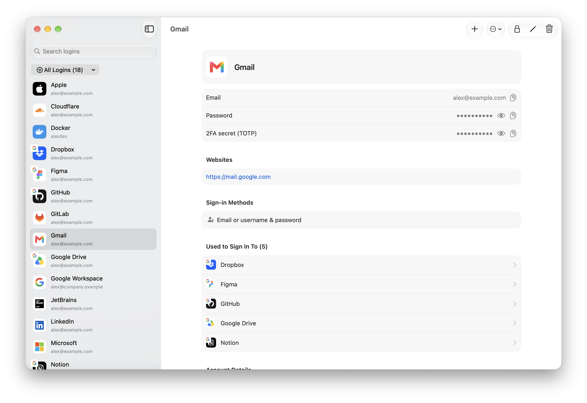
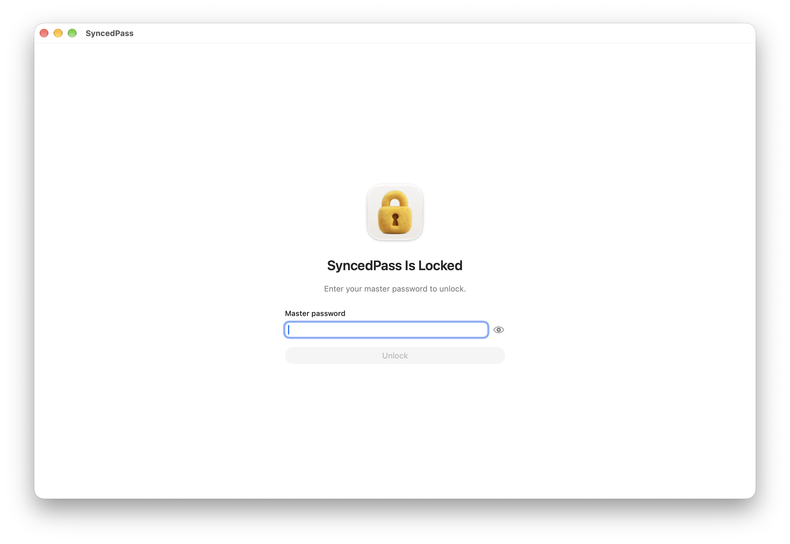
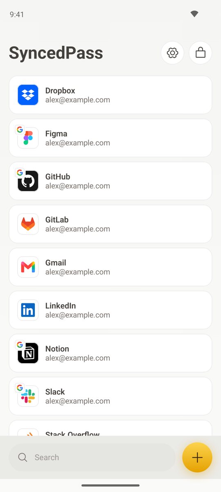
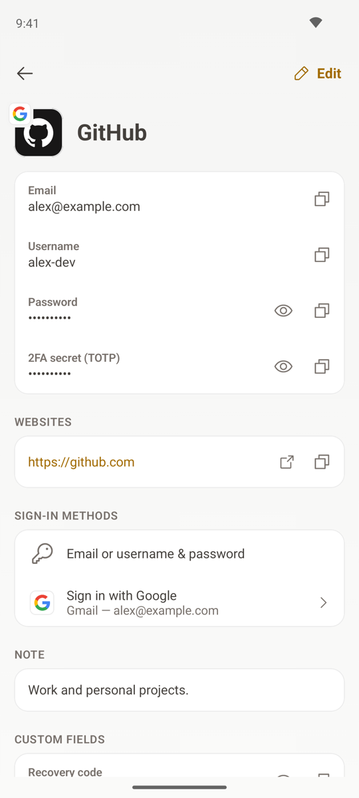

<div dir="rtl">

# SyncedPass

[English](README.md) · **العربية**

**الإصدار 0.2.0** · ‏macOS 15 أو أحدث (Swift 6 / SwiftUI) · أندرويد 8.0 أو أحدث (Kotlin / Jetpack Compose)

‏SyncedPass مدير كلمات مرور للماك وأندرويد، يحفظ بيانات تسجيل الدخول **على أجهزتك أنت فقط**، ويزامنها مباشرة بين جهاز الماك وهاتفك عبر شبكتك المحلية.

> **محلي فقط. بلا سحابة.**
> لا يحتاج SyncedPass إلى حساب، ولا يتصل بأي خادم أو خدمة سحابية. خزنتك ملف مشفّر على كل جهاز من أجهزتك ولا يُرفع إلى أي مكان. الاستخدام الوحيد للشبكة هو المزامنة مع هاتفك المرتبط، مباشرة عبر شبكتك المحلية: لا يتصل التطبيق ولا يقبل الاتصالات إلا داخل الشبكة المحلية، ولا يزامن إلا مع الأجهزة التي ربطتها. وشعارات الخدمات مضمّنة داخل التطبيق ولا تُحمَّل من الإنترنت.

> **الخصوصية أولًا.**
> لا تحليلات، ولا قياسات استخدام، ولا تقارير أعطال، ولا تتبّع: لا يرسل التطبيق شيئًا إلى أحد. ويعطّل كذلك مزايا macOS وأندرويد التي قد تمرّر بياناتك إلى Apple أو Google أو Samsung، مثل الحافظة العامة وأدوات الكتابة والملء التلقائي وتعلّم لوحة المفاتيح والمساعدات التي تقرأ الشاشة. انظر [PRIVACY.ar.md](PRIVACY.ar.md).

<div dir="ltr">



<p align="center"></p>

<p align="center">
  
  &nbsp;
  
</p>

</div>

<p align="center"><sub>البيانات الظاهرة في الصور نماذج وهمية.</sub></p>

---

## المزايا

- **بيانات تسجيل الدخول**: العنوان، البريد الإلكتروني، اسم المستخدم، كلمة المرور، رمز التحقق الثنائي (2FA)، المواقع، رقم الهاتف، الرمز السري (PIN)، الملاحظات، وحقول مخصصة (نص، مخفي، تحقق ثنائي، تاريخ). العنوان وحده إلزامي.
- **طرق تسجيل الدخول**: سجّل كيف تدخل إلى كل حساب («تسجيل الدخول عبر Google» أو «عبر Apple» أو بكلمة مرور أو بأكثر من طريقة)، وأي حساب من حساباتك تستخدم. ويعرض حساب Google مثلًا كل الخدمات التي تدخل إليها به.
- **شعارات 111 خدمة** تُتعرّف تلقائيًا من موقع الحساب أو عنوانه، مع شارة صغيرة على الشعار للحسابات التي تُفتح عبر Google أو غيرها.
- **بحث ذكي** يضع النتائج المطابقة للاسم والموقع أولًا، ويعرض المطابقة للبريد واسم المستخدم والملاحظات في قسم منفصل.
- **تصفية** حسب: كل الحسابات، الحسابات ذات كلمة مرور، أو الحسابات التي تُفتح عبر مزوّد معين.
- **نسخ احتياطية مشفّرة**: صدّر خزنتك إلى ملف ‎`.syncedpass`‎ محمي بكلمة مرور خاصة به، واستورده على أي ماك. الاستيراد يدمج البيانات ولا يُنشئ نسخًا مكررة.
- **استيراد ملف JSON من التطبيق القديم** (نسخة Flutter السابقة).
- **تطبيق أندرويد** بالحسابات والحقول والشعارات والنسخ الاحتياطية وتغيير كلمة المرور الرئيسية نفسها كما في الماك (انظر [android/README.md](android/README.md)).
- **المزامنة مع هاتفك الأندرويد** عبر شبكتك المحلية فقط: اربط الجهازين مرة واحدة بمطابقة رمز من 6 أرقام، ثم تتزامن التعديلات تلقائيًا، حسابًا بحساب، وبتشفير تام بين الطرفين. انظر [المزامنة](#المزامنة).
- **تغيير كلمة المرور الرئيسية** في أي وقت.
- **قفل تلقائي** عند سكون الماك أو قفل الشاشة، أو يدويًا بالاختصار ⌘L.
- **خصوصية في التصميم:** ما تنسخه يبقى على الجهاز، ويُخفى من سجل الحافظة، ويُمسح بعد 90 ثانية؛ ولا أدوات كتابة ولا ملء تلقائي ولا تعلّم للوحة المفاتيح في أي حقل؛ وعلى أندرويد الشاشة محمية من لقطات الشاشة والمساعدات. انظر [PRIVACY.ar.md](PRIVACY.ar.md).
- حذف عدة حسابات دفعة واحدة، وتقسيم حساب يجمع عدة خدمات إلى حسابات منفصلة، وزر إظهار/إخفاء في كل حقل سري.

## كيف يعمل

### أين تُحفظ بياناتك

تُحفظ كل البيانات في ملف واحد مشفّر داخل مجلد التطبيق الخاص في بيئة الحماية:

<div dir="ltr">

```
~/Library/Containers/com.abdurahmanharouat.SyncedPass/Data/Library/Application Support/SyncedPass/
├── vault.syncedpass            the vault (always the latest version)
└── vault.previous.syncedpass   the version before your last change
```

</div>

- يُكتب كل تعديل على القرص **قبل** أن يظهر على الشاشة، فإن فشل الحفظ بقي ما تراه مطابقًا لما هو محفوظ فعلًا.
- الكتابة ذرّية: يُكتب ملف جديد كاملًا ثم يحلّ محل القديم، فلا يمكن لانقطاع مفاجئ أن يترك خزنة نصف مكتوبة.
- لا يستطيع قراءة الملفين إلا حساب المستخدم الخاص بك على macOS.
- أثناء فتح الخزنة تكون البيانات المفكوكة في الذاكرة فقط، وتُمسح عند القفل أو إغلاق التطبيق.

### التشفير

<div dir="ltr">

```
master password ──PBKDF2-HMAC-SHA256 (600,000 rounds, random 16-byte salt)──▶ password key
password key ──AES-256-GCM──▶ wraps a random 256-bit vault key
vault key ──AES-256-GCM──▶ encrypts all logins
```

</div>

- **مفتاح الخزنة** عشوائي، وهو الذي يشفّر بياناتك. أما **كلمة المرور الرئيسية** فتفتح مفتاح الخزنة فقط.
- **‏AES-GCM تشفير موثَّق**: أي تغيير في الملف، ولو بايت واحد، يجعل فك التشفير يفشل بدل أن يُرجع بيانات معدّلة.
- كل جزء من الملف مربوط بغرضه، فلا يمكن تمرير محتوى خزنة على أنه نسخة احتياطية أو العكس.
- **تغيير كلمة المرور الرئيسية** يولّد مفتاح خزنة جديدًا تمامًا ويعيد تشفير كل شيء، فلا تبقى أي نسخة على القرص تُفتح بكلمة المرور القديمة.
- **لا توجد طريقة لاستعادة كلمة المرور الرئيسية.** إن نسيتها فلا يمكن فك تشفير الخزنة، لذا صدّر نسخة احتياطية بانتظام.

### النسخ الاحتياطية

- **تصدير نسخة احتياطية** يُنشئ ملف ‎`.syncedpass`‎ مشفّرًا بالطريقة نفسها، بكلمة مرور تختارها لهذه النسخة، وهي مستقلة عن كلمة المرور الرئيسية.
- **الاستيراد** يدمج النسخة مع الخزنة الحالية:
  - الحساب الموجود في الخزنة يبقى كما هو، إلا إن كانت نسخته في الملف أحدث تعديلًا؛
  - الحساب غير الموجود يُضاف، والحساب الذي حذفته بعد إنشاء النسخة يُستعاد (وتنتقل الاستعادة إلى هاتفك عند المزامنة)؛
  - كلمة المرور الرئيسية لا تتغير أبدًا عند الاستيراد.
- احفظ كلمة مرور كل نسخة احتياطية في مكان آمن، فأنت تحتاجها لفتح تلك النسخة.

### المزامنة

يتزامن SyncedPass مع تطبيق أندرويد عبر شبكتك المحلية، دون أي خادم بينهما. التصميم الكامل موجود في [docs/SYNC.md](docs/SYNC.md).

- **الربط مرة واحدة.** على الهاتف افتح **Settings ▸ Sync with Mac ▸ Pair with a Mac**، وعلى الماك اختر **SyncedPass ▸ Sync with Phone… ▸ Pair a Phone**. يجد الماك الهاتف ويتصل به، ويظهر على الجهازين رمز من 6 أرقام؛ إن تطابق، أكّد على الجهازين. يتبادل الجهازان مفاتيح دائمة، ويتعرّف كل منهما على الآخر بعد ذلك.
- **ثم يصبح كل شيء تلقائيًا.** ما دام SyncedPass مفتوحًا وغير مقفل على الجهازين وهما على الشبكة نفسها، يعلن كل منهما عن نفسه ويتصل بالآخر؛ ويُستخدم أي اتصال ينجح، وتنتقل التعديلات في الاتجاهين عبره، فيصل أي تعديل من أحدهما إلى الآخر خلال لحظات.
- **أذونات macOS.** في المرة الأولى يسأل macOS هل يمكن لـ SyncedPass العثور على الأجهزة في شبكتك المحلية، وإن كان جدار الحماية مفعّلًا، هل يمكنه قبول الاتصالات الواردة. اضغط Allow. وتستمر المزامنة حتى قبل أن تجيب، أو إن حجب macOS الاتصالات الواردة بعد تحديث، لأن الماك يتصل بالهاتف بنفسه أيضًا.
- **حسابًا بحساب.** لكل حساب وقت آخر تعديل، والتعديل الأحدث هو الذي يُعتمد لكل حساب على حدة. عدّل حسابًا على الماك وآخر على الهاتف، ولو دون اتصال، فيُحفظ التعديلان عند التقاء الجهازين. وحذف حساب يترك سجل حذف صغيرًا، فينتقل الحذف بدل أن يعود الحساب.
- **لا يُنقل إلا ما تغيّر.** يقارن الجهازان أولًا قائمة بمعرّفات الحسابات وأوقات تعديلها، ثم يرسل كل منهما الحسابات الناقصة لدى الآخر أو الأقدم لديه فقط.
- **مشفّر وموثَّق.** كل اتصال يستخدم مفاتيح جديدة (ECDH على P-256 وAES-256-GCM)، ويثبت كل طرف أنه يملك المفتاح الذي رُبط به (ECDSA). ومطابقة الرمز أثناء الربط تمنع أي شخص على الشبكة من التسلل بين الجهازين.
- **الشبكة المحلية فقط.** لا يستقبل أي من التطبيقين الاتصالات إلا وهو غير مقفل، وفقط إن كان مرتبطًا أو كانت نافذة الربط مفتوحة، ولا يتصل كلاهما إلا بعناوين الشبكة المحلية ولا يقبلان إلا الاتصالات القادمة منها. ويجب ألا يختلف توقيت الجهازين بأكثر من 5 دقائق، لأن الدمج يقارن أوقات التعديل.
- **إلغاء الربط**: ألغِ ربط جهاز مفقود من النافذة نفسها، فلا يستطيع الاتصال بعد ذلك.

## البناء

المتطلبات: ‏Xcode 26 أو أحدث، و‏macOS 15 أو أحدث.

<div dir="ltr">

```sh
open SyncedPass.xcodeproj        # then press ⌘R
```

```sh
xcodebuild -project SyncedPass.xcodeproj -scheme SyncedPass build
xcodebuild -project SyncedPass.xcodeproj -scheme SyncedPass test   # 90 tests
```

</div>

تطبيق أندرويد (يتطلب JDK 21 وAndroid SDK، والتفاصيل في [android/README.md](android/README.md)):

<div dir="ltr">

```sh
cd android
./gradlew installDebug         # build and install on a connected phone
./gradlew testDebugUnitTest    # 50 tests
```

</div>

## هيكل المشروع

<div dir="ltr">

```
SyncedPass/
  Models/          data model, encryption, vault storage, search, import, merging
  Sync/            local network sync: protocol, encryption, pairing (docs/SYNC.md)
  Views/           SwiftUI screens
  AppIcon.icon     layered app icon (open with Icon Composer)
  Assets.xcassets  bundled service logos
SyncedPassTests/   tests for encryption, storage, backups, search, import and merging
android/           the Android app (see android/README.md)
docs/SYNC.md       the sync protocol, implemented by both apps
PRIVACY.md         what the apps keep private, and how
Scripts/
  generate_services.py   rebuilds the service list and logos
  export_android_services.swift   copies the service list and logos to the Android app
  sync-harness/          a stand-in Mac for testing sync end to end from the Android tests
  app-icon/              source image and script for the app icon
```

</div>

شعارات الخدمات مأخوذة من [Simple Icons](https://simpleicons.org) و[gilbarbara/logos](https://github.com/gilbarbara/logos) (كلاهما برخصة CC0)، وبعضها أيقونات رسمية للخدمات نفسها. انظر [THIRD_PARTY_NOTICES.md](THIRD_PARTY_NOTICES.md).

## قائمة المهام

### تطبيق أندرويد (Jetpack Compose)

- [ ] كتابة مواصفات صيغة ملف الخزنة والنسخة الاحتياطية، المشتركة بين التطبيقين
- [x] إنشاء مشروع أندرويد بلغة Kotlin مع Jetpack Compose (بدون Material، انظر [android/README.md](android/README.md))
- [x] نقل التشفير (AES-256-GCM وPBKDF2-HMAC-SHA256 بـ 600,000 جولة)
- [x] اختبارات بين المنصتين: ملف يُكتب على الماك يُفتح على أندرويد والعكس
- [x] شاشات فتح الخزنة، وقائمة الحسابات، والبحث، وتعديل الحساب (بكل حقول محرر الماك)
- [x] شاشة تفاصيل الحساب (تعرض ما يحتويه الحساب فقط، وزر التعديل يفتح المحرر)
- [x] شعارات الخدمات وطرق تسجيل الدخول
- [x] استيراد النسخ الاحتياطية المشفّرة وتصديرها، وتغيير كلمة المرور الرئيسية
- [ ] الفتح بالبصمة أو الوجه (BiometricPrompt مع مفتاح في Android Keystore)
- [ ] الملء التلقائي في التطبيقات والمتصفحات الأخرى (Android Autofill Service)

### مزامنة آمنة بين الأجهزة (عبر الشبكة المحلية فقط)

- [x] تصميم بروتوكول المزامنة وتوثيقه قبل البرمجة ([docs/SYNC.md](docs/SYNC.md))
- [x] اكتشاف الأجهزة على الشبكة المحلية (Bonjour على macOS، وNetwork Service Discovery على أندرويد)
- [x] ربط الأجهزة مرة واحدة بمطابقة رمز من 6 أرقام
- [x] اتصال مشفّر وموثَّق من الطرفين بين الأجهزة المرتبطة فقط
- [x] يتصل التطبيقان ببعضهما تلقائيًا عند فتحهما على الشبكة نفسها (يمكن لأي منهما بدء الاتصال)
- [x] دمج تعديلات الجهازين حسابًا بحساب، اعتمادًا على وقت آخر تعديل لكل حساب
- [x] تسجيل عمليات الحذف حتى لا تعيد المزامنة حسابًا محذوفًا
- [x] عرض حالة المزامنة ووقت آخر مزامنة
- [x] إلغاء ربط جهاز مفقود
- [ ] المزامنة وتطبيق الهاتف في الخلفية (حاليًا يجب أن يكون التطبيقان مفتوحين وغير مقفلين)
- [ ] تجربة على هاتف حقيقي وشبكة Wi-Fi حقيقية (حتى الآن: المحاكي، واختبارات آلية عبر اتصال حقيقي)

### تحسينات تطبيق الماك

- [ ] قفل تلقائي بعد فترة من عدم الاستخدام
- [x] مسح كلمات المرور المنسوخة من الحافظة بعد وقت قصير
- [ ] مولّد كلمات مرور
- [ ] الفتح بـ Touch ID
- [ ] التراجع (⌘Z) عن التعديل والحذف
- [ ] نافذة الإعدادات (⌘,)
- [ ] نسخة إصدار (Release) مثبّتة في مجلد التطبيقات

## الرخصة

‏SyncedPass برنامج حر، مرخّص بموجب [رخصة جنو العمومية العامة، الإصدار 3.0 أو أحدث](LICENSE) ‏(GPL-3.0-or-later).

يحق لك استخدامه ودراسته وتعديله ومشاركته. وإن وزّعت نسخة معدّلة منه فعليك نشر شيفرتها المصدرية بالرخصة نفسها، حتى تبقى شيفرة أي نسخة يعتمد عليها الناس مفتوحة للفحص.

**لا تشمل هذه الرخصة** شعارات الخدمات الأخرى، فهي علامات تجارية لأصحابها ومضمّنة فقط للتعريف بتلك الخدمات. انظر [THIRD_PARTY_NOTICES.md](THIRD_PARTY_NOTICES.md).

</div>
